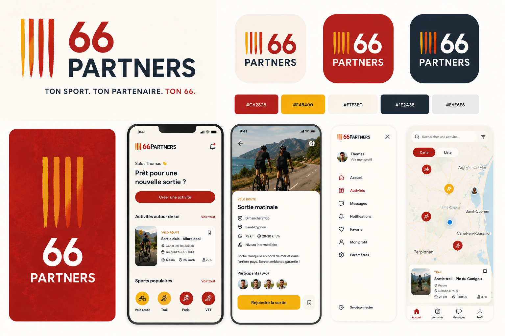
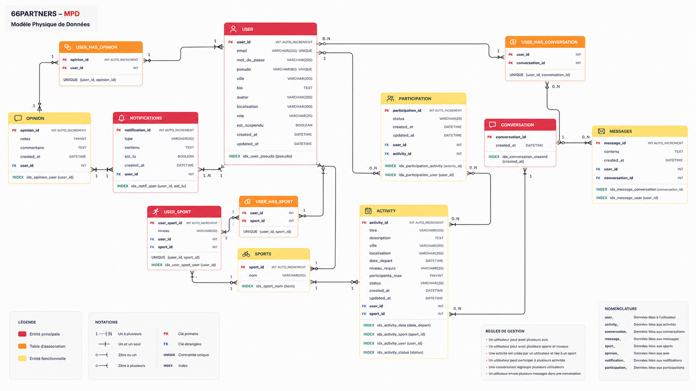
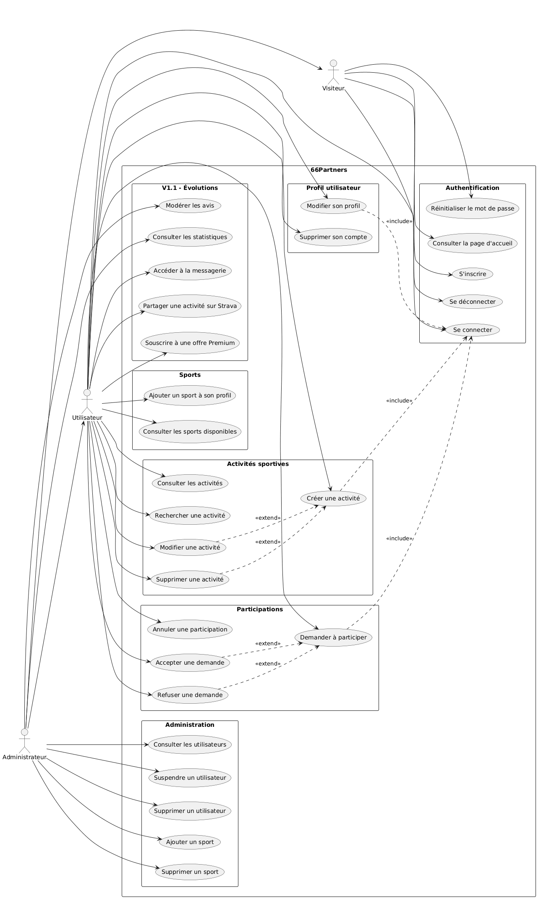
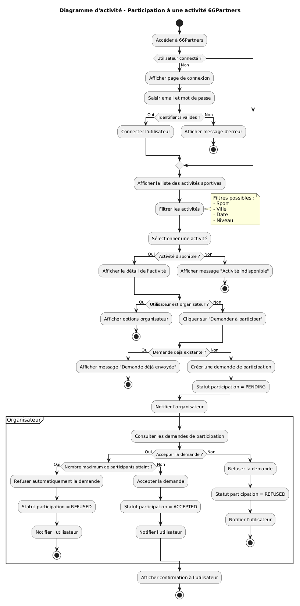

# <br><p align="center">Cahier des Charges - ***66Partners***</p>

<p align="center">
  
</p>

---

# <p align="center">SOMMAIRE</p>

## I. Présentation 👋

## II. Fonctionnalités du projet ⚙️

### II-1. MVP (Minimum Viable Product)

- Gestion des comptes utilisateurs
- Gestion des profils sportifs
- Gestion des sports
- Gestion des activités sportives
- Gestion des participations

### II-2. Version 1.1

#### Communication

- Messagerie entre participants

#### Système communautaire

- Avis et notation des utilisateurs
- Score de fiabilité

## III. Évolutions potentielles ↗️

### III-1. Version 2.0

- Application mobile React Native
- Intégration Strava
- Groupes sportifs
- Système Premium
- Suggestions intelligentes de partenaires

## IV. Architecture du projet 🏗️

## V. Technologies utilisées 🛠️

### V-1. Backend

- Runtime & Framework
- Infrastructure & Déploiement

### V-2. Base de données

### V-3. Frontend

- Framework & Build

## VI. Authentification & Sécurité 👮

### VI-1. Authentification

### VI-2. Validation & Sécurité

### VI-3. Qualité & Tests

## VII. Cible 🎯

### VII-2. Navigateurs compatibles

## VIII. Routes de l'application 🛣️

### VIII-1. Authentification

### VIII-2. Gestion utilisateur

### VIII-3. Sports

### VIII-4. Activités sportives

### VIII-5. Participations

### VIII-6. Messagerie

### VIII-7. Avis & Notations

## IX. User Stories 👥

### Rôle : Visiteur

### Rôle : Utilisateur

### Rôle : Administrateur

## X. Modèle de données 🗄️

### X-1 MCD

### X-2 MLD

### X-3 MPD

## XI. RGPD ⚖️

## XIV. Documents de conception 📄

### Diagrammes UML

### Diagrammes de séquence

### Cas d'utilisation (Use Cases)

---

# I. Présentation 👋


La pratique sportive est souvent freinée par une difficulté récurrente : trouver des partenaires ayant le même niveau, les mêmes disponibilités ou pratiquant la même activité.

Dans les Pyrénées-Orientales, de nombreux sportifs pratiquent régulièrement des activités telles que le vélo, le padel, le tennis, le trail ou encore la randonnée, mais peinent parfois à constituer un groupe ou à trouver un partenaire rapidement.

**66Partners** a pour objectif de répondre à ce besoin en proposant une plateforme locale de mise en relation sportive.

---

**66Partners** est une plateforme web permettant aux habitants des Pyrénées-Orientales de trouver facilement des partenaires de sport selon :

- leur localisation ;
- leur niveau ;
- leurs disponibilités ;
- leur discipline sportive.

L'application vise à favoriser la pratique sportive locale tout en développant une dimension sociale basée sur la confiance et le partage.

---

## Objectifs du projet

Les objectifs principaux sont :

- Faciliter la mise en relation entre sportifs.
- Encourager la pratique régulière du sport.
- Créer une communauté sportive locale.
- Permettre l'organisation rapide de sorties sportives.
- Offrir une expérience simple et intuitive.

---

## Zone géographique

Le lancement du projet est prévu exclusivement dans le département des **Pyrénées-Orientales (66)**.

Cette approche permet :

- de concentrer les efforts de communication ;
- d'obtenir une masse critique d'utilisateurs plus rapidement ;
- de valider le modèle économique avant une éventuelle extension régionale ou nationale.

---

## Sports concernés au lancement

### Sports individuels ou semi-collectifs

- Vélo de route
- VTT
- Running
- Trail
- Tennis
- Padel
- Badminton
- Randonnée

### Évolutions futures

- Escalade
- Surf
- Kitesurf
- Natation
- Sports collectifs
- Tout sport ajouté par un utilisateur

---

# II. Fonctionnalités du projet ⚙️

## II-1. MVP (Minimum Viable Product)

L'objectif du MVP est de valider l'intérêt du marché et de permettre aux utilisateurs de trouver rapidement un partenaire sportif.

### Gestion des comptes

- Création de compte
- Connexion (mail)
- Déconnexion
- Réinitialisation du mot de passe
- Modification du profil

### Gestion du profil sportif

- Photo de profil
- Description
- Sports pratiqués
- Niveau sportif
- Ville de résidence
- Disponibilités

### Gestion des activités sportives

- Création d'une activité
- Modification d'une activité
- Suppression d'une activité
- Consultation des activités disponibles

### Recherche et filtrage

Recherche selon :

- Sport
- Niveau
- Date
- Distance
- Localisation

### Gestion des participations

- Demande de participation
- Acceptation ou refus par l'organisateur
- Liste des participants
- Annulation d'une participation


---

## Règles métier principales

- Un utilisateur ne peut pas rejoindre sa propre activité.
- Une activité doit être planifiée dans le futur.
- Une participation est unique par utilisateur et par activité.
- Une activité ne peut pas dépasser son nombre maximum de participants.
- Seul le créateur de l'activité peut accepter ou refuser une participation.
- Une activité annulée n'accepte plus de nouvelles participations.
- Un utilisateur doit être authentifié pour créer une activité.
- Une activité possède un organisateur unique.
- Une activité ne peut dépasser son nombre maximum de participants.
- Seuls les participants d'une activité peuvent accéder à la messagerie associée.
- Un utilisateur ne peut laisser un avis qu'après avoir participé à une activité commune.
- Une activité passée ne peut plus être modifiée.

---

## II-2. Version 1.1

### Communication

- Messagerie entre participants


### Système communautaire

- Avis et notation des utilisateurs
- Score de fiabilité

## III. Évolutions potentielles ↗️

- Messagerie
- Avis
- Notifications
- Mobile
- Strava

### III-1. Version 2.0

- Application mobile React Native
- Intégration Strava
- Groupes sportifs
- Système Premium
- Suggestions intelligentes de partenaires


## IV. Architecture du projet 🏗️
J'ai opté pour une architecture client-serveur (ou architecture découplée) afin de séparer clairement les responsabilités entre le frontend et le backend, garantissant ainsi une meilleure maintenabilité et évolutivité du projet. Cette approche consiste en une API REST développée avec Node.js et Express, qui communique avec une Single Page Application (SPA) développée en React.

Le backend, orchestré avec Drizzle pour la gestion de la base de données PostgreSQL, expose des endpoints REST pour toutes les fonctionnalités métier : gestion des utilisateurs, sports, activités, participations, avis, review et notifcations pour les évolutions potentielles de l'application. Le frontend React consomme cette API via des requêtes HTTP (Axios), offrant une interface utilisateur dynamique et réactive.

Cette séparation  permet une plus grande flexibilité : le frontend peut évoluer indépendamment du backend, et l'API peut potentiellement servir d'autres clients (application mobile, autres interfaces). L'ensemble est orchestré via Docker pour assurer l'isolation des services et la portabilité entre environnements.

Pour les données de sport, sera utilisée une table locale afin de recenser tous les sports pouvant être pratiqué par les utilisateurs qui le souhaitent. Et l'API Géo du Gouvernement Français afin de récupérer toutes les communes du département .Le backend servant de passerelle pour filtrer et enrichir ces données avant de les exposer au frontend. 

Cette architecture découplée offre un bon équilibre entre simplicité de développement pour un MVP et possibilités d'évolution futures.

## V. Technologies utilisées 🛠️
### V-1. Backend
- **Node.js** : Environnement d'exécution JavaScript côté serveur
- **Express.js** : Framework web minimal et flexible
- **TypeScript** : Langage typé pour une meilleure robustesse

#### Infrastructure & Déploiement
- **Docker** : Containerisation complète (obligatoire V1.0)
- **Nginx** : Reverse proxy et SSL termination (obligatoire V1.0) (à voir)
- **Docker Compose** : Orchestration multi-conteneurs

### V-2. Base de données
- **PostgreSQL** : SGBD relationnel avec support JSON natif (conteneur Docker)
- **Redis** : Cache et sessions haute performance (conteneur Docker)
- **Drizzle** : ORM pour Node.js avec protection anti-injection SQL

### V-3. Frontend
- **React 18** : Bibliothèque UI avec hooks et concurrent features
- **Vite** : Build tool ultra-rapide avec HMR optimisé
- **TypeScript** : Cohérence avec backend, types automatiques


## VI. Authentification & Sécurité 👮
### VI-1. Authentification
- **Argon2** : Algorithme de hachage sécurisé 
- **JWT**

### VI-2. Validation & Sécurité

- **Zod** : Validation de schémas avec typage automatique
- **Helmet** : Headers de sécurité HTTP
- **CORS** : Gestion Cross-Origin Resource Sharing via Nginx
- **SSL/TLS** : HTTPS obligatoire en production via Nginx

### VI-3. Qualité & Tests

- **Jest** : Framework de tests unitaires et d'intégration
- **Supertest** : Tests spécialisés pour endpoints API
- **@faker-js/faker** : Génération de données de test réalistes
- **ESLint + Prettier** : Qualité et formatage du code

## VII. Cible 🎯

Du sportif amateur au sportif de compétition.

### VII-2. Navigateurs compatibles

L'application **66Partners** sera compatible avec les navigateurs web modernes les plus récents. La liste précise des versions supportées sera affinée au fur et à mesure de l'avancement du projet, en fonction des technologies et fonctionnalités spécifiques qui seront implémentées.
Support prévu :

- Chrome 90+
- Firefox 88+
- Safari 14+
- Edge 90+

Note : Internet Explorer ne sera pas supporté, conformément aux standards actuels du développement web moderne.
Cette approche nous permet de nous concentrer sur les navigateurs représentant la majorité du trafic web actuel tout en bénéficiant des dernières fonctionnalités et standards web pour offrir une expérience utilisateur optimale.


## VIII. Routes de l'application 🛣️

### VIII-1. Authentification

| Méthode | Route                 | Description                          | Données attendues                                     |
| ------- | ---------------------- | ------------------------------------- | ------------------------------------------------------ |
| POST    | `/api/auth/register`   | Inscription utilisateur               | `{ firstname, lastname, username, email, password }`   |
| POST    | `/api/auth/login`      | Connexion utilisateur                 | `{ email, password }` OU `{ username, password }`      |
| POST    | `/api/auth/logout`     | Déconnexion utilisateur               | -                                                       |
| POST    | `/api/auth/refresh`    | Rafraîchir le token d'accès           | `{ refreshToken }`                                      |
| POST    | `/api/auth/forgot-password` | Demande de réinitialisation      | `{ email }`                                             |
| POST    | `/api/auth/reset-password`  | Réinitialisation du mot de passe | `{ token, newPassword }`                                |

### VIII-2. Gestion utilisateur

| Méthode | Route                | Description                    | Données attendues                                       |
| ------- | --------------------- | -------------------------------- | -------------------------------------------------------- |
| GET     | `/api/me`             | Récupérer le profil connecté     | -                                                          |
| PUT     | `/api/me/profile`     | Modifier le profil               | `{ pseudo, city, bio, avatar, location }`                 |
| DELETE  | `/api/me`             | Supprimer le profil               | -                                                          |
| GET     | `/api/users/:id`      | Consulter le profil public d'un utilisateur | -                                            |

### VIII-3. Sports

| Méthode | Route                  | Description                   | Données attendues          |
| ------- | ----------------------- | -------------------------------- | ---------------------------- |
| GET     | `/api/sports`           | Lister tous les sports            | -                              |
| GET     | `/api/sports/:id`       | Récupérer un sport                | -                              |
| POST    | `/api/sports`           | Ajouter un sport                  | `{ name }`                    |
| DELETE  | `/api/sports/:id`       | Supprimer un sport                | -                              |

### VIII-4. Sports pratiqués par l'utilisateur (UserSport)

| Méthode | Route                          | Description                            | Données attendues          |
| ------- | -------------------------------- | ----------------------------------------- | ---------------------------- |
| GET     | `/api/me/sports`                 | Lister les sports pratiqués (avec niveau) | -                              |
| POST    | `/api/me/sports`                 | Ajouter un sport pratiqué                 | `{ sportId, level }`          |
| PUT     | `/api/me/sports/:sportId`        | Modifier le niveau pour un sport          | `{ level }`                    |
| DELETE  | `/api/me/sports/:sportId`        | Retirer un sport pratiqué                 | -                              |

### VIII-5. Activités sportives

| Méthode | Route                  | Description                          | Données attendues                                                                 |
| ------- | ----------------------- | --------------------------------------- | ------------------------------------------------------------------------------------ |
| GET     | `/api/activities`       | Lister les activités (filtrage + pagination) | Query params : `?sport=&level=&date=&radius=&city=&page=&limit=`               |
| GET     | `/api/activities/:id`   | Récupérer le détail d'une activité       | -                                                                                       |
| POST    | `/api/activities`       | Créer une activité                       | `{ title, description, city, location, startDate, levelRequired, maxParticipants, sportId }` |
| PUT     | `/api/activities/:id`   | Modifier une activité                    | `{ title, description, city, startDate, levelRequired, maxParticipants }`            |
| DELETE  | `/api/activities/:id`   | Supprimer/annuler une activité           | -                                                                                       |

### VIII-6. Participations

| Méthode | Route                                  | Description                | Données attendues |
| ------- | ----------------------------------------- | ----------------------------- | -------------------- |
| GET     | `/api/activities/:id/participations`      | Lister les participants d'une activité | -        |
| POST    | `/api/activities/:id/join`                | Demande de participation       | -                    |
| PUT     | `/api/participations/:id/accept`          | Accepter une demande           | -                    |
| PUT     | `/api/participations/:id/refuse`          | Refuser une demande            | -                    |
| DELETE  | `/api/participations/:id`                 | Annuler une participation      | -                    |

### VIII-7. Messagerie

| Méthode | Route                                  | Description                  | Données attendues   |
| ------- | ----------------------------------------- | -------------------------------- | ---------------------- |
| GET     | `/api/conversations`                      | Lister les conversations          | -                       |
| GET     | `/api/conversations/:id/messages`         | Lister les messages d'une conversation (pagination) | Query params : `?page=&limit=` |
| POST    | `/api/conversations/:id/messages`         | Envoyer un message                | `{ content }`           |

### VIII-8. Avis & Notations

| Méthode | Route                  | Description           | Données attendues                       |
| ------- | ----------------------- | ------------------------ | ------------------------------------------ |
| GET     | `/api/users/:id/reviews` | Lister les avis reçus par un utilisateur | -                          |
| POST    | `/api/reviews`           | Ajouter un avis           | `{ targetUserId, activityId, rating, comment }` |
| DELETE  | `/api/reviews/:id`       | Supprimer un avis         | -                                            |

### VIII-9. Notifications

| Méthode | Route                            | Description                       | Données attendues |
| ------- | ----------------------------------- | -------------------------------------- | -------------------- |
| GET     | `/api/notifications`                | Lister les notifications de l'utilisateur (pagination) | Query params : `?page=&limit=&unreadOnly=` |
| PUT     | `/api/notifications/:id/read`       | Marquer une notification comme lue     | -                    |
| PUT     | `/api/notifications/read-all`       | Marquer toutes les notifications comme lues | -               |

### VIII-10. Administration

| Méthode | Route                          | Description                       | Données attendues |
| ------- | --------------------------------- | -------------------------------------- | -------------------- |
| GET     | `/api/admin/users`                 | Lister les utilisateurs inscrits (pagination) | Query params : `?page=&limit=` |
| PUT     | `/api/admin/users/:id/suspend`     | Suspendre un utilisateur               | -                    |
| DELETE  | `/api/admin/users/:id`             | Supprimer un utilisateur               | -                    |
| POST    | `/api/admin/sports`                | Ajouter un sport (catalogue)           | `{ name }`            |
| DELETE  | `/api/admin/sports/:id`            | Supprimer un sport (catalogue)         | -                    |

---

### Notes

- Toutes les routes sauf `/api/auth/*` et `GET /api/activities`, `GET /api/sports` nécessitent un token JWT valide (header `Authorization: Bearer <token>`).
- Les routes `/api/admin/*` nécessitent en plus un rôle `admin`.
- La pagination par défaut est fixée à `page=1&limit=20` si non spécifiée.
- Pensez à préfixer l'ensemble des routes par une version d'API, ex. `/api/v1/...`, pour faciliter les évolutions futures.


## IX. User Stories 👥

#### Rôles Utilisateurs

- **Visiteur** : Utilisateur non connecté découvrant l'application
- **Utilisateur** : Utilisateur connecté gérant sa bibliothèque personnelle
- **Administrateur** : Rôle de modération et gestion globale

## 👥 Rôle : Visiteur (non connecté)

### 🚀 V1.0 (MVP) - Fonctionnalités Essentielles

| En tant que                      | Je souhaite que                                                                                     | Afin de                                                                      |
| -------------------------------- | --------------------------------------------------------------------------------------------------- | ---------------------------------------------------------------------------- |
| **US-V01**: En tant que visiteur | je veux voir une page d'accueil présentant 66Partners afin de découvrir rapidement l'application et m'inciter à m'inscrire         |
| **US-V02**: En tant que visiteur | je veux m'inscrire avec un email et un mot de passe                                                 | afin de créer un compte sécurisé et accéder aux fonctionnalités personnelles |
| **US-V03**: En tant que visiteur | je veux me connecter avec mes identifiants                                                          | afin d'accéder à mon compte existant                                         |
| **US-V04**: En tant que visiteur | je veux pouvoir réinitialiser mon mot de passe |               |


## 👥 Rôle : Utilisateurs

### 🚀 V1.0 (MVP) - Fonctionnalités Essentielles

| En tant que                                 | Je souhaite que                                                                            | Afin de                                         |
| ------------------------------------------- | ------------------------------------------------------------------------------------------ | ----------------------------------------------- |
| **US-U01**: En tant qu'utilisateur connecté | je veux voir les sport populaires autour de chez moi                                            | afin de mieux m'orienter |
| **US-U02**: En tant qu'utilisateur connecté | je veux voir les activités autour de chez moi                  | afin d'y participer     |
| **US-U03**: En tant qu'utilisateur connecté | je veux pouvoir ajouter un sport si celui ci n'apparait pas | afin de pouvoir créer des activités          |
| **US-U04**: En tant qu'utilisateur connecté | je veux me déconnecter de manière sécurisée                                                | afin de protéger mes données personnelles.      |
| **US-U05**: En tant qu'utilisateur connecté | je veux modifier mes informations de profil                                                | afin de maintenir mes données à jour.           |
| **US-U06**: En tant qu'utilisateur connecté | je veux pouvoir supprimer mon profil                                                |       |
| **US-U07**: En tant qu'utilisateur connecté | je veux pouvoir demander à participer à une activité                                  | afin de faire de nouvelles connaissances          |
| **US-U08**: En tant qu'utilisateur connecté | je veux pouvoir me retirer d'une activité                                          |           |
| **US-U09**: En tant qu'utilisateur connecté | je veux accéder à ma messagerie                                          | afin de me tenir au courant de mes participations |
| **US-U10** | En tant qu'utilisateur connecté | je veux créer une activité sportive | afin de trouver des partenaires |
| **US-U11** | En tant qu'utilisateur connecté | je veux modifier une activité dont je suis l'organisateur | afin de mettre à jour ses informations |
| **US-U12** | En tant qu'utilisateur connecté | je veux supprimer une activité dont je suis l'organisateur | afin d'annuler une sortie |
| **US-U13** | En tant qu'utilisateur connecté | je veux accepter une demande de participation | afin de constituer mon groupe |
| **US-U14** | En tant qu'utilisateur connecté | je veux refuser une demande de participation | afin de contrôler les participants |

### 🌱 V1.1 - Améliorations Rapides

| En tant que                                 | Je souhaite que                                                                                      | Afin de                                                        |
| ------------------------------------------- | ---------------------------------------------------------------------------------------------------- | -------------------------------------------------------------- |
| **US-U15**: En tant qu'utilisateur connecté | je veux partager mes sorties sur Strava                                                     | afin de partager mes résultats avec mes abonnés|
| **US-U16**: En tant qu'utilisateur connecté | je veux pouvoir payer une version premium si il y a                     |

### 📱 V2.0 - Extension Mobile

| En tant que                                 | Je souhaite que                                   | Afin de                                        |
| ------------------------------------------- | ------------------------------------------------- | ---------------------------------------------- |
| **US-U15**: En tant qu'utilisateur connecté | je veux pouvoir lancer le arcours via strava | afin de l'ajouter directement dans l'application |

## 👥 Rôle : Administrateur

### 🚀 V1.0 (MVP) - Fonctionnalités Essentielles

| En tant que                           | Je souhaite que                                                                                  | Afin de                                                             |
| ------------------------------------- | ------------------------------------------------------------------------------------------------ | ------------------------------------------------------------------- |
| **US-A01**: En tant qu'administrateur |consulter les utilisateurs inscrits    | superviser la plateforme.                   |
| **US-A02**: En tant qu'administrateur | suspendre un utilisateur   | limiter les abus                |
| **US-A03**: En tant qu'administrateur | supprimer un utilisateur                | respecter les règles de la plateforme |                 |
| **US-A04**: En tant qu'administrateur | ajouter un sport             |maintenir le catalogue  |
| **US-A05**: En tant qu'administrateur | supprimer un sport |  maintenir le catalogue              |


### 🌱 V1.2 - Améliorations Rapides

| En tant que                           | Je souhaite que                                                                                                        | Afin de                                                                |
| ------------------------------------- | ---------------------------------------------------------------------------------------------------------------------- | ---------------------------------------------------------------------- |
| **US-A07**: En tant qu'administrateur | je veux modérer les avis et commentaires des utilisateurs (supprimer ou éditer)                                        | afin de maintenir un environnement respectueux et conforme aux règles. |
| **US-A08**: En tant qu'administrateur | je veux accéder à des statistiques globales de la plateforme (nombre d'utilisateurs, livres les plus populaires, etc.) | afin d'analyser l'usage et proposer des améliorations.                 |

### 🔒 V1.2 - Sécurité Avancée

| En tant que                            | Je souhaite que                                                  | Afin de                                                   |
| -------------------------------------- | ---------------------------------------------------------------- | --------------------------------------------------------- |
| **US-A09**: En tant qu'administrateur  | je veux configurer les paramètres de sécurité de l'application   | afin de protéger la plateforme contre les vulnérabilités. |
| **US-A010**: En tant qu'administrateur | je veux créer et gérer différents niveaux d'accès administrateur | afin d'organiser la gestion de l'équipe                   |


                           |

                           
## X. Modèle de données 🗄️
### X-1 MCD
## Entités principales

### User

- id
- email
- password
- pseudo
- city
- bio
- avatar
- createdAt
- updatedAt
- location

### Sport

- id
- name


### Activity

- id
- title
- description
- city
- startDate
- levelRequired
- maxParticipants
- creatorId
- sportId
- location

### Participation

- id
- userId
- activityId
- status

### Notification
- id
- type
- isRead
- userId
- relatedId
- createdAt

### X-2 MLD

### X-3 MPD

## RGPD (Réglement Général sur la protection des données) ⚠️

## **1**. Inventorier les données personnelles collectées:

- Liste toutes les données collectées : nom, prénom, email, mot de passe, , avis, adresse IP, cookies, etc. Ne collecte que ce qui est nécessaire au fonctionnement de la plateforme (principe de minimisation).

## **2**.Afficher une politique de confidentialité:

- Publier une politique de confidentialité claire, accessible depuis toujours (ex : pied de page). Elle doit expliquer :

- Qui est responsable du traitement des données

- Les finalités des traitements (inscription,- Profil sportif
- Sports pratiqués
- Activités créées
- Participations
- Messagerie
- Avis et notations)

- Les bases légales (ex : exécution du contrat ou consentement)

- Les droits utilisateurs (accès, rectification, suppression, limitation, opposition, portabilité)

- La durée de conservation de chaque type de donnée

- À qui les données sont transmises le cas échéant.

## **3**. Consentement explicite là où nécessaire:

- Ajoute des cases à cocher pour le consentement lors de l’inscription ou de l’ajout d’options (ex : recevoir une newsletter).

- _Cookie banner_: informe clairement sur la présence de cookies et leur utilisation, et permets un choVIII granulaire (nécessaires, statistiques, marketing…).

## **4.** Faciliter l’exercice des droits des personnes.

Permet aux utilisateurs de :

- Accéder à leurs données (section "mon compte")
- Les modifier, les supprimer ou demander leur suppression
- Récupérer leurs données (droit à la portabilité)
- Retirer leur consentement aussi facilement qu’ils l’ont donné.

## **5.** Sécurité des données

- Utilise le chiffrement (https pour le site, mots de passe hashés)
- Limite l’accès aux données aux seules personnes nécessaires
- Mets en place des sauvegardes et procédures en cas de violation (notifier toute fuite sous 72h à la CNIL et aux utilisateurs concernés)
- Documente les mesures de sécurité et conserve un registre des traitements.

## **6.** Registre des traitements

Même pour une petite application, maintiens un registre des traitements : chaque traitement (ex : création de compte, gestion des listes…), les données concernées, la finalité, durée de conservation, éventuels sous-traitants, mesures de sécurité, etc..

## **7.** Information & gestion des cookies/traceurs

Informer sur l’utilisation de cookies ou traceurs et permettre le refus sauf ceux strictement nécessaires.

Mettre en place un gestionnaire de cookies conforme (bandeau, consentement granulaire…).

## **8.** Sensibiliser l’équipe (si elle existe)

Toute personne ayant accès aux données doit être sensibilisée à la protection de la vie privée et à la sécurité.

**RGPD et Mentions Légales :** mettre en place les mentions légales liées au règlement général sur la protection des données (RGPD).

```
  ** Au RGPD : articles 5.2 (responsabilité), 25 (privacy by design) et 33 (notification des violations)
  ** À la loi française "Informatique et Libertés" modifiée (loi n°78-17 du 6 janvier 1978) : articles 82 à 84 sur la sécurité des données
  ** Au Code pénal français : articles 323-1 à 323-7 sur les atteintes aux systèmes de traitement automatisé de données
```


# Documents de Conception

## <p align="center" p> MPD (Modele Physique de Données)



## <p align="center" p> Diagramme de Séquence


### Description

1. L'organisateur crée une sortie avec les informations clés (sport, date, lieu, niveau, nombre de places).
2. L'événement est enregistré en base, puis Socket.io diffuse une notification aux utilisateurs concernés (proximité géographique, sport pratiqué).
3. Un participant intéressé consulte le détail de la sortie via l'API.
4. Lors de l'inscription, l'API vérifie d'abord qu'il reste des places disponibles.
5. Si une place est libre, le participant est ajouté en base et tous les membres de la room Socket.io de l'événement (organisateur compris) reçoivent une mise à jour en temps réel.
6. Si la sortie est complète, une erreur claire est renvoyée à l'utilisateur.


#### Description

1. L'utilisateur lance une recherche de partenaire (sport, niveau, rayon de recherche).
2. L'API interroge PostgreSQL avec PostGIS pour récupérer les profils dans la zone géographique demandée.
3. Redis est consulté pour connaître les disponibilités en temps réel (mis à jour en cache).
4. Les résultats triés sont renvoyés et affichés à l'utilisateur.
5. L'utilisateur envoie une demande de match à un profil.
6. La demande est enregistrée en base, puis Socket.io notifie instantanément l'utilisateur cible.

## <p align="center" p> Use Case



## <p align="center" p> Diagramme d'Activité




