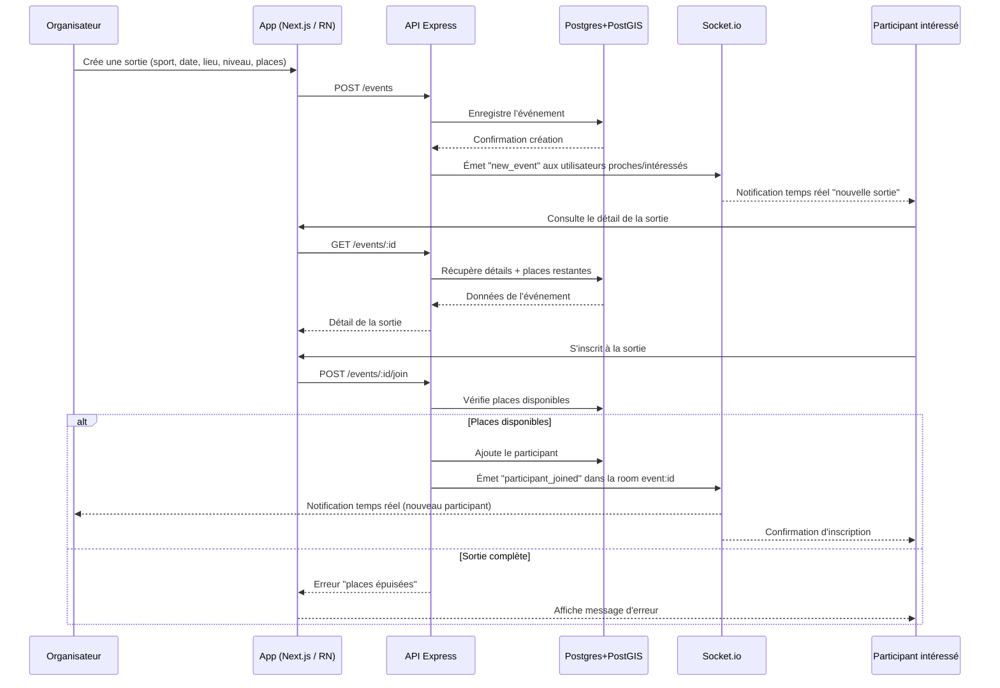

# Diagramme de séquence — Création et inscription à une sortie

## Description

1. L'organisateur crée une sortie avec les informations clés (sport, date, lieu, niveau, nombre de places).
2. L'événement est enregistré en base, puis Socket.io diffuse une notification aux utilisateurs concernés (proximité géographique, sport pratiqué).
3. Un participant intéressé consulte le détail de la sortie via l'API.
4. Lors de l'inscription, l'API vérifie d'abord qu'il reste des places disponibles.
5. Si une place est libre, le participant est ajouté en base et tous les membres de la room Socket.io de l'événement (organisateur compris) reçoivent une mise à jour en temps réel.
6. Si la sortie est complète, une erreur claire est renvoyée à l'utilisateur.