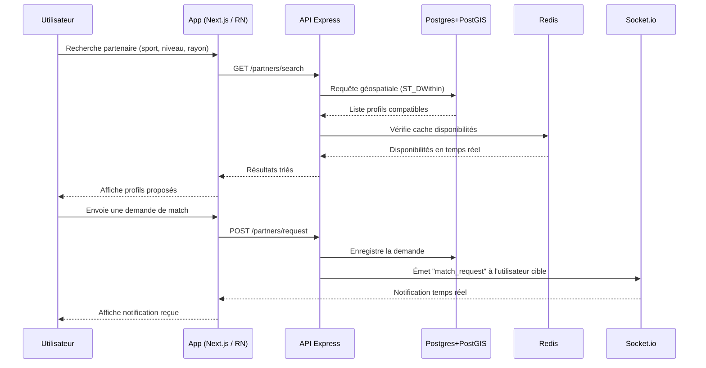

# Diagramme de séquence — Recherche & matching de partenaire

## Description

1. L'utilisateur lance une recherche de partenaire (sport, niveau, rayon de recherche).
2. L'API interroge PostgreSQL avec PostGIS pour récupérer les profils dans la zone géographique demandée.
3. Redis est consulté pour connaître les disponibilités en temps réel (mis à jour en cache).
4. Les résultats triés sont renvoyés et affichés à l'utilisateur.
5. L'utilisateur envoie une demande de match à un profil.
6. La demande est enregistrée en base, puis Socket.io notifie instantanément l'utilisateur cible.