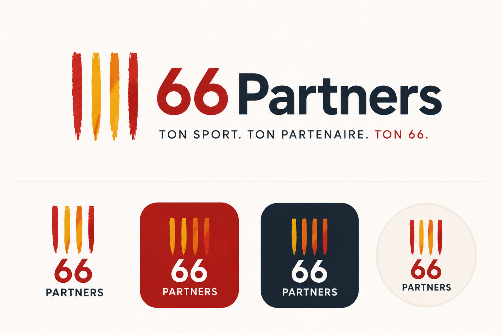

# <p align="center">66Partners</p>

<p align="center">
  
</p>

<p align="center">
  <strong>Trouve ton partenaire de sport dans les Pyrénées-Orientales.</strong>
</p>

<p align="center">
  Tennis • Padel • Running • Vélo • Badminton • Trail • Randonnée
</p>

---

## 📖 À propos

**66Partners** est une plateforme de mise en relation sportive permettant aux habitants des **Pyrénées-Orientales (66)** de trouver rapidement des partenaires de sport adaptés à leur niveau, leur localisation et leurs disponibilités.

L'objectif est simple :

> Ne plus renoncer à une activité sportive parce qu'on n'a personne avec qui la pratiquer.

Le projet est développé dans un premier temps sous forme d'**application web**, avant une évolution vers une **application mobile React Native**.

---

## 🎯 Fonctionnalités

### MVP

- Création de compte
- Gestion du profil sportif
- Création de sorties sportives
- Recherche de partenaires
- Géolocalisation des activités
- Gestion des participations
- Messagerie entre participants
- Avis et notation des utilisateurs

### Évolutions futures

- Notifications temps réel
- Application mobile
- Intégration Strava
- Groupes sportifs locaux
- Système Premium
- Suggestions intelligentes de partenaires

---

## 🛠 Stack technique

### Frontend

- React
- TypeScript
- SCSS
- TanStack Query
- React Router

### Backend

- Node.js
- Express
- TypeScript
- Drizzle ORM

### Base de données

- PostgreSQL

### Temps réel

- Socket.io

### DevOps

- Docker
- Docker Compose

---

## 📱 Aperçu

### Application mobile


### Maquettes

Les maquettes UI/UX sont disponibles dans :

```txt
Conception/
└── Maquettes/
```

---

## 📂 Architecture du projet

```txt
66Partners/
│
├── backend/
│   └── src/
│
├── frontend/
│   └── src/
│
├── Conception/
│   ├── CahierDesCharges/
│   ├── Maquettes/
│   └── Documentation/
│
├── docker/
│
└── README.md
```

---

## 📔 Documentation

Toute la documentation du projet est disponible dans le dépôt :

- Cahier des charges
- Maquettes UI/UX
- Architecture technique
- Roadmap produit

---

# 🚀 Lancement du projet avec Docker

## 📦 Prérequis

- Docker
- Docker Compose
- Node.js ≥ 18 (optionnel)

---

## ⚙️ Environnement de développement

### Installation des dépendances

#### Backend

```bash
npm run docker:dev:install:backend
```

#### Frontend

```bash
npm run docker:dev:install:frontend
```

---

### Démarrer le projet

```bash
npm run docker:dev
```

Services disponibles :

| Service | URL |
|----------|----------|
| Frontend | http://localhost:5173 |
| Backend API | http://localhost:3000 |
| PostgreSQL | localhost:5432 |

Fonctionnalités :

- Hot Reload
- Volumes Docker montés automatiquement
- Environnement de développement complet

---

### Rebuild des conteneurs

#### Backend

```bash
npm run docker:dev:install:backend
```

#### Frontend

```bash
npm run docker:dev:install:frontend
```

#### Rebuild complet

```bash
npm run docker:dev:build
```

---

### Nettoyage

```bash
npm run docker:dev:clean
```

Cette commande :

- Stoppe les conteneurs
- Supprime les volumes associés
- Nettoie le cache Docker

---

### Accès shell backend

```bash
npm run docker:dev:shell
```

---

# 🌐 Environnement de production

## Démarrer

```bash
npm run docker:prod
```

---

## Rebuild complet

```bash
npm run docker:prod:build
```

---

## Nettoyage

```bash
npm run docker:prod:clean
```

---

## Accès shell

```bash
npm run docker:prod:shell
```

---

## 📋 Scripts disponibles

| Script | Description |
|----------|----------|
| `npm run lint` | Lint backend et frontend |
| `npm run lint:fix` | Correction automatique du lint |
| `npm run docker:dev` | Lance l'environnement de développement |
| `npm run docker:dev:install:backend` | Installation dépendances backend |
| `npm run docker:dev:install:frontend` | Installation dépendances frontend |
| `npm run docker:dev:build` | Rebuild complet dev |
| `npm run docker:dev:clean` | Nettoyage complet dev |
| `npm run docker:dev:shell` | Shell backend dev |
| `npm run docker:prod` | Lance l'environnement de production |
| `npm run docker:prod:build` | Rebuild complet prod |
| `npm run docker:prod:clean` | Nettoyage complet prod |
| `npm run docker:prod:shell` | Shell backend prod |

---

## 🗺 Roadmap

### MVP

- [x] Architecture du projet
- [x] Dockerisation
- [x] Maquettes UI/UX
- [ ] Authentification
- [ ] Gestion des profils
- [ ] Création de sorties
- [ ] Recherche de partenaires
- [ ] Géolocalisation
- [ ] Gestion des participations
- [ ] Messagerie

### Version 1.0

- [ ] Notifications temps réel
- [ ] Système d'avis
- [ ] Tableau de bord utilisateur

### Version 2.0

- [ ] Application mobile React Native
- [ ] Intégration Strava
- [ ] Groupes sportifs
- [ ] Fonctionnalités Premium

---

## ❤️ Projet local

**66Partners** est un projet né dans les **Pyrénées-Orientales** avec l'ambition de créer une communauté sportive locale forte, accessible et conviviale.

### Slogan

> **Ton partenaire, ton sport, ton 66.**